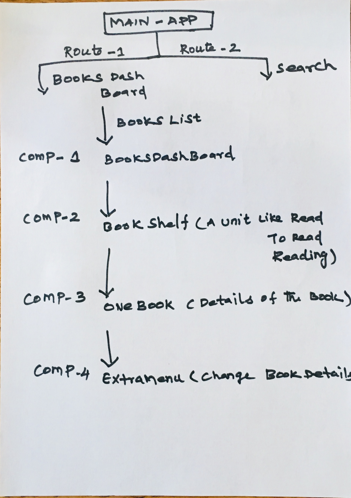

# react-project1
 Bookshelf app that allows you to select and categorize books you have read, are currently reading, or want to read.

## Installation

Clone the repository,and use NPM to install the dependencies.

npm install

## To start the application

- `npm start`

This automatically opens the below URL with app running

- [http://localhost:3000](http://localhost:3000)

## Feature-1 Listing the books in the Books Dashboard woth category

planned structure 

